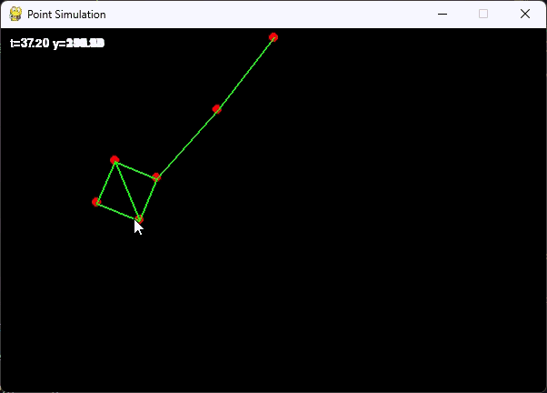
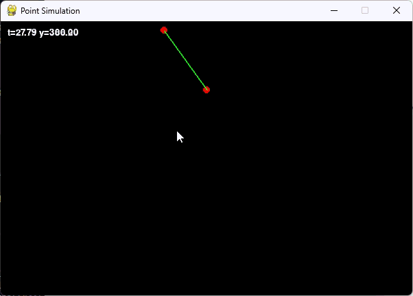
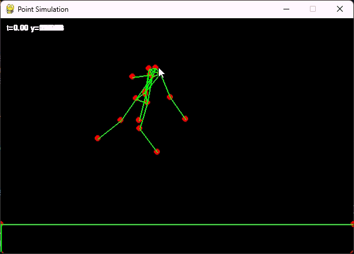
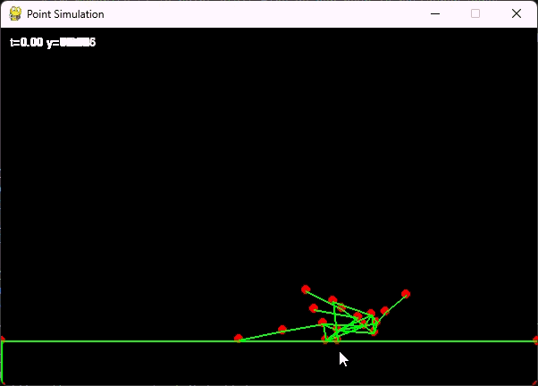

# Ragdoll Physics Simulator

A high-performance 2D physics engine developed as a 4th-year engineering project. This simulator focuses on articulated body dynamics (Ragdolls) using a robust constraint-based approach.

## Overview

This project features two distinct implementations:

- Python: Developed for rapid iteration, debugging, and visual validation of physical laws.

- C++: An optimized production-ready version focusing on memory efficiency and computation speed.

## Technical Architecture

The engine follows a modular pipeline designed for stability and precision:

### 1. Classes

#### a. Point

The **Point** class is the fundamental building block of the engine, representing a localized mass in 2D/3D space. It stores physical state variables including position, velocity, and acceleration. A key feature is the inclusion of an "inverse mass" (w=1/m), where a value of 0.0 signifies an infinite mass (a fixed, unmovable point). The class also maintains a `_old_pos` attribute, essential for the **Velocity Verlet** integration and for calculating post-collision velocities.

#### b. Edge

The **Edge** class defines a structural constraint between two `Point` objects. It acts as a distance constraint (or a spring/bone) that maintains a specific length (l) between particles. Each edge has a stiffness or relaxation factor (s), allowing for both rigid links in ragdoll skeletons and elastic connections. During the simulation's constraint relaxation phase, the `Edge` calculates the error between the current distance and its rest length to adjust the points' positions accordingly.

#### c. Body

The **Body** class serves as a container for a collection of points and edges, forming a coherent physical object (like a ragdoll, a polygon, or a beam). It manages the object's visual state (wireframe vs. solid) and its simulation state (frozen or active). Each body can also possess its own set of local forces, allowing for modular physical behaviors where different objects in the same world can react to different physical laws.

#### d. World

The **World** class is the central orchestrator of the simulation. It manages the global environment, including global forces (like gravity or wind) and the list of all active bodies. Its primary responsibility is the **Execution Loop** (`run_step`), which synchronizes:

1. **Integration**: Updating positions using the Velocity Verlet scheme.

2. **Constraint Satisfaction**: Iteratively solving the distance constraints within edges.

3. **Collision Handling**: Detecting intersections between points and volumes and applying impulse-based resolutions or positional corrections.

### 1. Force Application

- **External Forces:** Global environmental effects like **Gravity** and dynamic **Wind** vectors.

- **Internal/User Forces**: Manual **Impulses** and local body forces used for procedural animation or user interaction.

### 2. Numerical Integration

The engine is built on the **Velocity Verlet** integration scheme. Each point affected by the external forces follow this algorithm:

```python
acc_n = self.computeAccel(body, p)
p.acc = acc_n
p.pos = p.pos + self.h*p.vel + ((self.h**2)/2)*p.acc
p.acc = self.computeAccel(body, p)
p.vel = p.vel + (self.h/2)*(acc_n + p.acc)
```

### 3. Constraints & Ragdoll Logic

Articulated skeletons are simulated using **Distance Constraints** solved via iterative relaxation (Jakobsen’s method). For each `Edge`, the engine calculates the positional error:

$error=\frac{current\_dist−rest\_length}{current\_dist}​$

This error is then projected onto the connected points according to their respective masses to stabilize the "bones" of the ragdoll.

### 4. Collision Handling

- **Detection:** Implementation of the **SAT (Separating Axis Theorem)** for precise convex polygon intersection.

- **Resolution:** Impulse-based resolution to handle penetration depth and kinetic energy transfer.

## Physics & Mathematics

- **Integration:** In-depth implementation of Velocity Verlet to minimize numerical drift.

- **Constraints:** Solving linear systems for rigid link stability.

- **SAT Method:** Detailed geometric projection to calculate the Minimum Translation Vector (MTV).

## Visual Examples

### a. Python

* Simple pendulum 



* Spring



* Drag



* Impulsion



## Installation & Use

## Stretch Goals (Future Improvements)

## 
